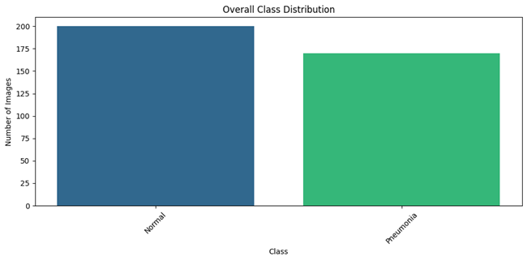
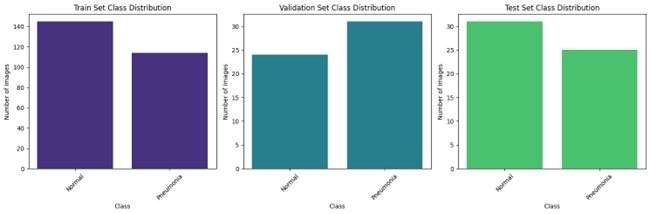
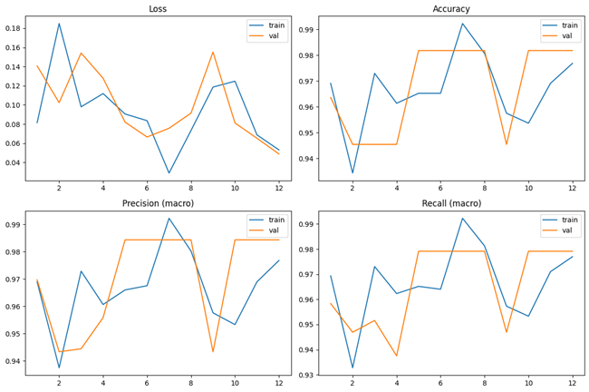
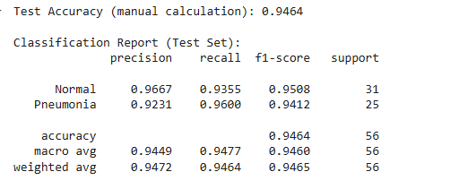
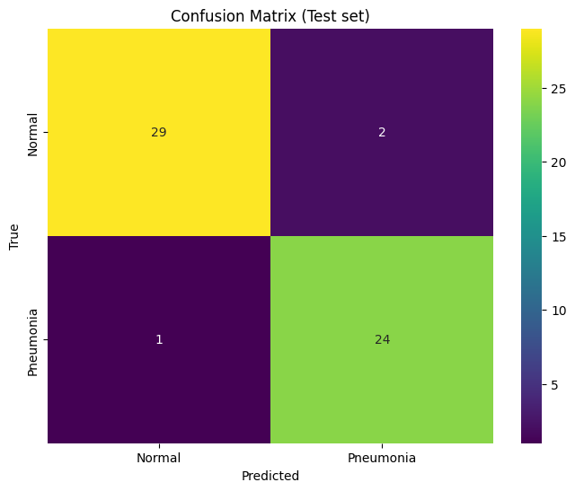
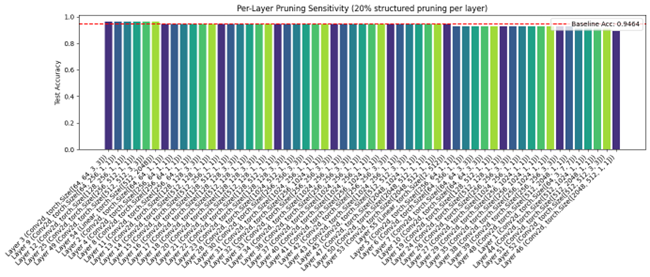
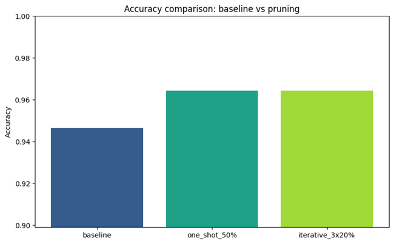
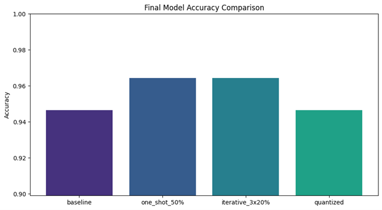

# 🩺 ChestXNet-PruneQuant — Project Report  

**Deep learning–based pneumonia detection from chest X-rays with pruning & quantization**  

---

## 📑 Executive Summary  

This project develops and evaluates an efficient deep-learning pipeline to classify chest X-ray images as **Normal** or **Pneumonia**.  

- Backbone: **ResNet50 (pretrained)** with a compact classification head  
- Dataset: **378 images** (Normal: 200, Pneumonia: 178)  
- Compression: **Pruning & Dynamic Quantization**  

**Key Findings (example run):**
- Baseline test accuracy ≈ **94.64%**  
- Pruned variants ≈ **96.43%**  
- Quantized models preserved baseline accuracy while reducing size for CPU inference ✅  

---

## 📖 1. Introduction  

Early, accurate detection of pneumonia from chest radiographs can significantly improve patient outcomes.  
While deep neural networks deliver strong performance, real-world deployment often requires **smaller, faster models**.  

This work aims to:  
- Train a high-quality classifier  
- Apply **pruning** and **quantization** for model compression  
- Preserve—or even improve—performance while making the model practical for **edge devices**  

---

## 📊 2. Dataset & Preprocessing  

### 2.1 Dataset  
- **Total images:** 378  
- **Normal:** 200  
- **Pneumonia:** 178  
- **Structure:** Standard *ImageFolder* layout (one folder per class).  

  
*Figure 1 — Class distribution of the dataset.*  

---

### 2.2 Splitting & Reproducibility  
- Train / Val / Test: **70% / 15% / 15%**  
- Stratified splits preserve class balance  
- Seeded for reproducibility  

  
*Figure 2 — Train/Validation/Test dataset split.*  

---

### 2.3 Preprocessing & Augmentation  
- **Input size:** 224 × 224 (ResNet50 requirement)  
- **Augmentations:** horizontal flip, ±10° rotation, color jitter  
- **Normalization:** ImageNet mean/std  
- **Imbalance handling:** WeightedRandomSampler + class-weighted loss  

---

## 🏗️ 3. Model Architecture  

- **Backbone:** ResNet50 (pretrained on ImageNet)  
- **Head:**  
  - Linear(2048 → 512) → BatchNorm → ReLU → Dropout(0.5) → Linear(512 → 2)  

💡 *Rationale:* ResNet50 provides strong feature extraction, while the lightweight head ensures regularization and good fit for small datasets.  

---

## ⚙️ 4. Training & Evaluation Protocol  

- **Optimizer:** Adam (lr = 1e-4)  
- **Loss:** Weighted CrossEntropy (optional: FocalLoss)  
- **Batch size:** 32 | **Epochs:** 12  
- **Metrics tracked per epoch:**  
  - Accuracy, Precision, Recall, F1 (macro)  
  - AUC (ROC & PR)  
  - Loss (train & validation)  

👉 Best model selected by **minimum validation loss** → saved as `best_model.pth`  

---

## 📈 5. Results  

### 5.1 Training Behavior  
- Training converged quickly with augmentations & regularization  
- Validation metrics stable with minor fluctuations  

  
*Figure 3 — Training vs Validation curves.*  

---

### 5.2 Test Performance (example run)  
- **Baseline test accuracy:** ≈ **94.64%**  
- Balanced precision/recall across classes  
- Only one critical false negative in test set  

  
*Figure 4 — Classification Report.*  

  
*Figure 5 — Confusion Matrix.*  

---

## 🪓 6. Model Optimization  

### 6.1 Pruning — What & Why  
- **Unstructured pruning:** removes low-magnitude weights → sparse matrices  
- **Structured pruning:** removes entire filters/channels → real speedups  
- **Benefits:** lower size, potential accuracy gain (regularization)  
- **Risks:** over-pruning can harm accuracy  

---

### 6.2 Pruning in this project  
- **One-shot global L1 pruning (50%)**  
- **Iterative pruning (3 × 20%)** with optional fine-tuning  
- **Per-layer sensitivity analysis** identifies robust vs critical layers  

**Example results:**  
- One-shot (50%): ≈ **96.43%**  
- Iterative (3×20%): ≈ **96.43%**  

  
*Figure 6 — Layer-wise pruning sensitivity.*  

  
*Figure 7 — Baseline vs Pruning Accuracy Comparison.*  

---

### 6.3 Quantization — What & Why  
- Reduces precision (FP32 → INT8)  
- **Dynamic quantization:** fast, applied post-training → best for Linear/LSTM layers  
- **Benefits:** smaller model size + faster CPU inference  
- **Applied here:** dynamic quantization of Linear layers → accuracy preserved  

---

## 📊 7. Comparative Summary (example run)  

| Model Variant              | Test Accuracy |
|-----------------------------|---------------|
| Baseline (FP32)             | ≈ 94.64%      |
| One-shot prune (50%)        | ≈ 96.43%      |
| Iterative prune (3×20%)     | ≈ 96.43%      |
| Dynamic quantized (INT8)    | ≈ 94.64%      |

  
*Figure 8 — Comparative Analysis of Baseline, Pruned, and Quantized Models.*  

---

## ✅ 8. Conclusions & Recommendations  

- **Fine-tuned ResNet50** delivers strong performance on small dataset (≈ 95% accuracy)  
- **Pruning** can *improve* generalization while reducing redundancy  
- **Quantization** reduces size & improves CPU latency with negligible accuracy loss  
- For deployment:  
  - Perform multiple runs & cross-validation  
  - Measure latency on target devices (ARM/mobile)  
  - Explore QAT & structured pruning for further runtime gains  

---

📌 **Next Steps:** Extend dataset, test on multiple seeds, and benchmark on edge devices.  
